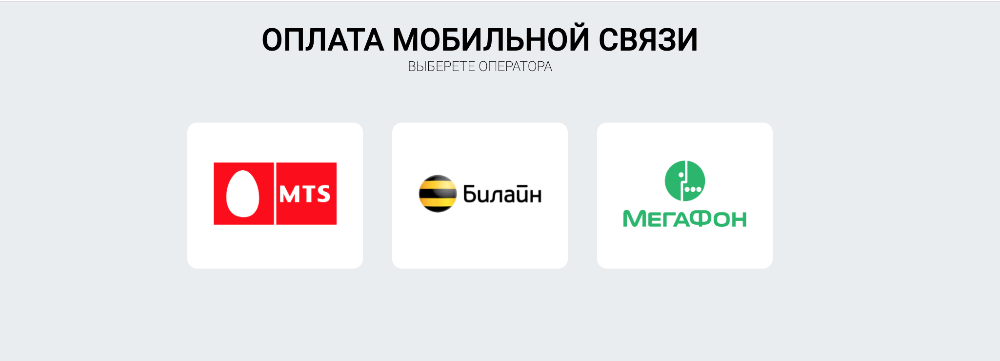

## Тестовое заданиe для Brave-developers

[Демо](https://brave-developers.herokuapp.com/)

### Стэк
* Next.js
* React
* Typescript
* Styled-Components
* Formik
* react-input-mask

### Техническое задание
В приложении должен быть главный экран со списком операторов - МТС, Билайн,
Мегафон. Список должен быть расширяем. По клику на оператора переходить на
экран формы оплаты.
Экран с формой оплаты должен содержать выбранного оператора, поле ввода
телефона с маской и валидацией, и поле ввода суммы в рублях с маской и
валидацией (мин 1 и макс 1000 руб). Кнопка подтверждения, которая ожидает ответа
от сервера. После ответа показывается сообщение об успехе или об ошибке. В случае
успеха переходим на основной экран.

* Стэк: TypeScript, Next.js, React и React Hooks, Styled-Components.

* Обращение к API должны быть эмулированы. Ответы должны быть успешные
или неуспешные в случайном порядке.

* Дизайн и верстка на ваше усмотрение, но сделайте красиво и добавьте
анимации

* При этом верстка должна быть адаптивной и поддерживать различные размеры
экранов, включая мобильные.

